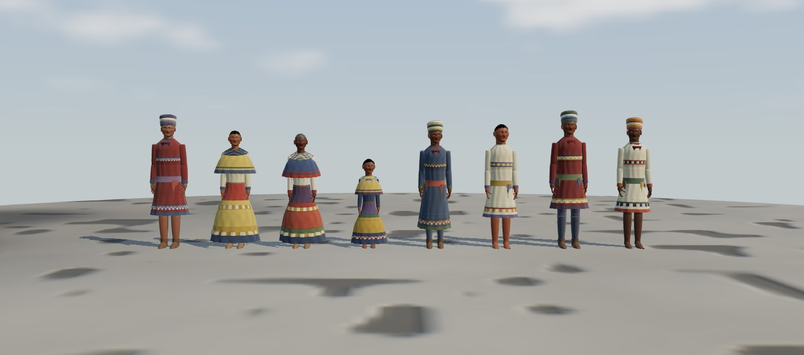

# seminole
Seminole is a 3d game where the user is part of a Seminole tribe in the 1900s

## Playing

The game runs in the browser using [three.js](https://threejs.org/) and
[Vite](https://vite.dev/). You need [Node.js](https://nodejs.org/) 20.19 or
newer and a browser with WebGL.

```sh
npm install
npm run dev
```

Then open the URL Vite prints (usually http://localhost:5173). You will see
your character standing in a camp in the Florida Everglades around 1900: a
palmetto-thatched chickee, a star fire with an iron kettle, a dugout canoe by
a tannin-dark pond, cypress, cabbage palms, saw palmetto and sawgrass, and
seven animated villagers (a farmer, a lawman, a trader, a hunter, a laborer
and two civilians) going about their routines (see [Villagers](#villagers-npcs)). A **How to Play** panel listing the controls
is shown when the game starts; press `H` to hide or show it again.

## Controls

Movement is relative to the camera: "forward" is the direction the camera
is looking.

| Action                                  | Keys         |
| --------------------------------------- | ------------ |
| Move forward                            | `W` / `↑`    |
| Move back                               | `S` / `↓`    |
| Move left                               | `A` / `←`    |
| Move right                              | `D` / `→`    |
| Run (hold)                              | `Shift`      |
| Jump                                    | `Space`      |
| Crouch (hold)                           | `C`          |
| Look around                             | `Drag mouse` |
| Zoom                                    | `Scroll`     |
| Show / hide this panel                  | `H`          |
| Select next villager (debug)            | `N`          |
| Play next animation on villager (debug) | `M`          |
| Return villager to routine (debug)      | `B`          |
| Show / hide FPS and NPC info (debug)    | `G`          |

Tips:

- Use WASD or the arrow keys to move.
- Hold Shift while moving to run.
- Press Space while moving to jump over obstacles.
- Hold C to crouch.

**Point** at the chickee, fire, mortar, canoe or a villager to highlight it
and see a short description. Outside the flat camp clearing the character
follows the height of the terrain.

Walk speed, the run multiplier, jump strength and crouch speed are set in
`src/config.js`. Key bindings are set in `src/input.js`.

## Look and rendering

The aim is believable, polished realism, not photorealism:

- Physically based materials only (`MeshStandardMaterial` /
  `MeshPhysicalMaterial`) with albedo, normal and roughness maps.
- sRGB output, ACES filmic tone mapping and a procedural HDR sky used as both
  background and image-based environment light.
- A directional sun with soft (PCF, wide-radius) 2048² shadow maps, plus mild
  linear fog that matches the hazy horizon.
- Height-varied terrain that blends grass, dirt and mud with height-based
  splatting (`src/terrain.js`).
- Instanced vegetation: every plant type has 2-3 procedural variants and
  randomised position, rotation, scale and tint.
- A procedural, seeded player character (see [Characters](#characters)) with
  PBR skin, strand-card hair, layered period clothing and idle, walk and run
  animations.
- Premade, rigged and skinned villagers (CC0, glTF) driven by a shared
  animation library (see [Villagers](#villagers-npcs)).

The world, props and player are generated in code; the only binary assets
are the CC0 villager models and clips in `public/models/npc/`. See
[ASSETS_LICENSES.md](ASSETS_LICENSES.md).

## Scripts

| Command           | What it does                                   |
| ----------------- | ---------------------------------------------- |
| `npm run dev`     | Start the dev server with hot reload           |
| `npm run build`   | Build a static production bundle into `dist/`  |
| `npm run preview` | Serve the production build locally             |
| `npm test`        | Run the unit tests with Vitest                 |

## Project layout

```
index.html              Page shell, HUD, hover prompt and the How to Play panel container
src/main.js             Entry point: checks for WebGL and starts the game
src/game.js             Renderer, camera, controls, player movement, NPC loading, debug keys, hover highlighting and the main loop
src/config.js           Movement constants (speeds, jump, crouch)
src/input.js            Keyboard bindings and held-key tracking
src/movement.js         Character movement: walking, running, jumping and crouching over the terrain
src/controls-panel.js   The How to Play panel (built from the key bindings)
src/character.js        Builds characters from parameters; proportions; idle, walk and run animations
src/character-params.js Seeded character parameters (body, face, skin, hair, clothing) per variant
src/character-geometry.js  Sculpted head, ears, eyes, hair cards, hands, feet, garments and patchwork
src/character-materials.js Skin (with subsurface-like shading), hair, eye and cloth textures and materials
src/lineup.js           Character lineup page (characters.html, dev server only)
src/npc/assets.js       Loads the NPC glTF models and clips, clones and tints NPC bodies
src/npc/retarget.js     Retargets library clips onto each model skeleton; upper / lower body masks
src/npc/actions.json    Action registry: logical action names -> clips, fallbacks, blend and gait settings
src/npc/animation-library.js    Resolves actions (with fallbacks) and idle variants for one skeleton
src/npc/animation-controller.js Per-NPC animation state machine (crossfades, gaits, layers, idle variety)
src/npc/roles.json      Role profiles, places, seats and the demo population
src/npc/roles.js        Loads and validates roles.json
src/npc/npc.js          One NPC: body, controller, waypoint movement and the role's task loop
src/npc/population.js   Spawns the population, pairs idle NPCs up to talk, debug selection
src/npc-lineup.js       NPC lineup / clip viewer page (npcs.html, dev server only)
src/debug-overlay.js    FPS counter and selected-NPC state overlay
public/models/npc/      The NPC models and animation library (built by tools/npc-assets)
tools/npc-assets/       Script that builds public/models/npc from the CC0 source packs
src/world.js            Assembles the world: sky, fog, sun, terrain, pond, chickee, props, plants
src/sky.js              Procedural HDR sky / environment map
src/terrain.js          Height field, ground-layer weights and the splat shader
src/vegetation.js       Plant variants and instanced scattering
src/structures.js       The chickee
src/props.js            Fire pit, kettle, mortar, baskets, woodpile, canoe
src/interaction.js      Hover highlight and prompt for interactive objects
src/materials.js        Shared PBR materials and the material audit helper
src/textures.js         Procedural PBR texture sets
src/geometry.js         Geometry helpers (merging, strips, lumpy blobs)
src/noise.js            Deterministic noise functions
src/layout.js           Where things sit in the camp
src/style.css           Page, HUD, prompt and panel styles
tests/                  Vitest unit tests
```

## Villagers (NPCs)

The villagers are premade, rigged human models by
[Quaternius](https://quaternius.com) (CC0): the head of a *Universal Base
Character* joined to the parts of a *Modular Character Outfits* outfit, all
bound to one humanoid skeleton. They are animated with clips from the
*Universal Animation Library* 1 and 2, which use the same rig, so every clip
plays on every model. There are three models in
`public/models/npc/npc-characters.glb` (`man` and `woman` in work shirts and
trousers, `hunter` in buckskin leathers and boots); each villager also picks
a hair style, an optional beard, a height and colour tints for clothing, skin
and hair, so no two look the same. Sources and licences are in
[ASSETS_LICENSES.md](ASSETS_LICENSES.md).

This is a game-art interpretation like the player character: the outfits
are generic period work clothes, not Seminole dress, and have not been
reviewed by Seminole cultural advisors.

### How it works

- **Animation library** (`src/npc/actions.json`, `src/npc/animation-library.js`):
  maps logical action names to clips. Each action lists the clip names that
  genuinely show it and a `fallback` action used when none of them is in the
  library; the chain always ends at a real clip. When the assets load, every
  clip is retargeted to each model's skeleton (`src/npc/retarget.js`), so
  differences in bone lengths and rest pose do not distort the poses.
- **Animation controller** (`src/npc/animation-controller.js`): one per NPC,
  on three.js' `AnimationMixer`. The NPC sets a posture (`stand`, `crouch`,
  `sit`, `carry`), its speed and, for tasks, an action; the controller
  crossfades to the right clip over `blendDuration` (0.3 s by default, in
  `actions.json`; stopping from a run takes 1.5×). Idle ↔ walk ↔ run ↔
  sprint are chosen from the speed with hysteresis
  (`locomotion.walkThreshold` 0.15 m/s, `runThreshold` 2.0 m/s,
  `sprintThreshold` 4.2 m/s) and the playback rate follows the speed.
  Sitting down and standing up play their own clips. Upper-body layers let a
  seated villager eat or drink, and a villager stood still while carrying
  keep their arms full.
- **Idle variety**: while standing idle, a villager plays one of its role's
  idle variants (looking around, folding arms, nodding, ...) for 3-5 s every
  2.5-6 s, never the same one twice in a row. Idle villagers within 3.2 m of
  each other may turn to face one another and talk.
- **Roles and schedules** (`src/npc/roles.json`): each role has a look, an
  `idleSet`, a `walkSpeed` multiplier, a `workClip` and a looping `tasks`
  list (`walk`, `work`, `play`, `idle`, `sit`, `crouch`; see
  `src/npc/roles.js`). For example the farmer walks to the field, harvests,
  wipes his brow, picks up a basket, carries it to the chickee, puts it down
  and sits by the fire to eat. Movement is straight lines between named
  waypoints, easing in and out (no pathfinding).
- **Demo population**: `population` in `roles.json` spawns one villager per
  role plus a second civilian. Each runs a full loop in 25-55 s.

| Role     | Model    | Walk × | Work clip     | Idle set                                     | Loop |
| -------- | -------- | ------ | ------------- | -------------------------------------------- | ---- |
| farmer   | man      | 0.95   | `farm`        | wipe brow, look around, cross arms           | field → farm → wipe brow → pick up → carry to store → put down → sit and eat |
| lawman   | man      | 1.05   | `point`       | check equipment, cross arms, look around     | patrol (walk), run to the lookout, check equipment, point, walk back, stand watch |
| trader   | woman    | 0.85   | `talk`        | cross arms, nod, look around                 | stand at the stall, wave, haggle, fetch a basket from the crates, point |
| hunter   | hunter   | 1.10   | `tool_work`   | look around, shift weight, nod               | fix the canoe, walk to the shore, fish, run back to camp, rest |
| laborer  | man      | 1.00   | `chop`        | wipe brow, shift weight, scratch head        | chop wood, wipe brow, carry wood to the fire, crouch to stoke it, rest |
| civilian | woman / man | 0.90 | `water_crops` | look around, cross arms, nod, shift weight  | visit the trader, water the garden, sit by the fire and drink, stroll |

### Debug keys and the clip viewer

- `N` selects the next villager (a ring marks it), `M` plays the next
  registered action on it (all 25 required actions first, then the helper
  and idle actions; 52 in total) and pauses its routine, `B` sends it back
  to its routine, and `G` toggles an overlay with an FPS counter and the
  selected villager's task, posture, gait, current clip and last crossfade
  duration. The action and the clip it resolved to are also logged to the
  console.
- `npm run dev` and open `/npcs.html` to see every role's look in a row.
  `?action=farm` plays one action on all of them, `?t=0.5` freezes it half
  way, and `M` steps through every action.

### Actions and fallback clips

All 25 actions resolve to a clip; the test suite fails if one does not. The
actions without a dedicated clip in the free libraries use these stand-ins:

| Action | Clip used | How |
| ------ | --------- | --- |
| `walk` / `run` / `sprint` | `Walk_Loop` / `Jog_Fwd_Loop` / `Sprint_Loop` | own clips |
| `crouch` / `sit` / `stand_up` | `Crouch_Idle_Loop` / `Sitting_Idle_Loop` / `Sitting_Exit` | own clips (sitting down plays `Sitting_Enter`) |
| `carry` / `pick_up` / `talk` | `Walk_Carry_Loop` / `PickUp_Table` / `Idle_Talking_Loop` | own clips |
| `eat` / `tool_work` / `farm` / `chop` | `Consume` / `Fixing_Kneeling` / `Farm_Harvest` / `TreeChopping_Loop` | own clips |
| `fight` / `reload` / `death` | `Punch_Cross` / `Pistol_Reload` / `Death01` | own clips (debug only) |
| `open_door` | `Interact` | **fallback** via `interact` (reach forward) |
| `ride` | `Driving_Loop` | **fallback** via `drive` (seated, hands forward; debug only) |
| `point` | `Interact` | **fallback** via `interact` (points with the index finger) |
| `wave` | `Idle_Rail_Call` | **fallback** via `call_out` (raised, beckoning hand) |
| `drink` | `Consume` | **fallback** via `eat` |
| `fish` | `Idle_Lantern_Loop` | **fallback** via `hold_out` (arm held out, as if holding a rod) |
| `cover` | `Crouch_Idle_Loop` | **fallback** via `crouch` (debug only) |
| `injured_walk` | `Zombie_Walk_Fwd_Loop` | **fallback** via `shamble` (limping shuffle; debug only) |
| `fall` | `Hit_Knockback` | **fallback** via `knockback` (falls on the back; debug only) |
| idle `look_around` | `Idle_No_Loop` | **fallback** via `idle_head_shake` |
| idle `shift_weight` | `Idle_FoldArms_Loop` | **fallback** via `idle_cross_arms` |
| idle `scratch_head` | `Idle_No_Loop` | **fallback** via `idle_look_around` |
| idle `check_equipment` | `Idle_Torch_Loop` | **fallback** via `idle_hold_torch` (hand to chest) |
| idle `wipe_brow` | `Yes` | **fallback** via `idle_nod` |
| idle `cross_arms` / `nod` | `Idle_FoldArms_Loop` / `Yes` | own clips |

Combat, riding, cover, injury, falling and death have no gameplay yet; their
clips are registered and can be played with the debug keys only.

### Adding a model, clip or role

- **A clip**: add its name to `CLIPS` in `tools/npc-assets/build.mjs` (it
  must use the Quaternius universal humanoid rig, i.e. the bone names in the
  existing files), run `./fetch-sources.sh` and `npm install && npm run
  build` in `tools/npc-assets/`, then list the clip name first in the
  action's `clips` in `src/npc/actions.json`. A clip named in `clips` takes
  over from the fallback automatically; add a new entry to `actions` for a
  new action. Record the source in ASSETS_LICENSES.md.
- **A model**: add an entry to `MODELS` in `tools/npc-assets/build.mjs`: the
  part whose skeleton is shared, a base-character file for the head (cut at
  the collar), the outfit parts and any optional hair (`hair_*`) or `beard`
  meshes. Rebuild; the new scene name can then be used as `look.model`.
  Models on the same rig need no other changes: clips are retargeted when the
  game loads them.
- **A role**: add it under `roles` in `src/npc/roles.json` with `label`,
  `prompt`, `look`, `idleSet`, `walkSpeed`, `workClip` and `tasks`, add any
  new waypoints to `places` (or seats to `seats`), and add a villager with
  that role to `population`. `validateRoles()` (run by the tests) reports
  unknown places, seats or task types.

### Performance

Measured with the overlay's FPS counter and `renderer.info` in headless
Chromium with software WebGL (SwiftShader, so absolute numbers are low),
same camera, before (seven procedural villagers) and after (seven premade
villagers): see the pull request for the numbers. The villagers use fewer
draw calls than the procedural ones did; all seven NPCs' behaviour and
animation take about 0.2 ms of CPU per frame. The models and clips are
6.5 MB and load in the background after the world appears.

## Characters

The player is built in code from a seeded
set of parameters (`generateCharacterParams(seed, variant)` in
`src/character-params.js`); the same seed always gives the same person and
different seeds give different faces, builds and clothing. There are six
variants: `elderMan`, `elderWoman`, `man`, `woman`, `teen` and `child`.

- **Body:** height, build, age and sex drive every length. Adults are 7.1 to
  7.7 heads tall, teens about 6.7 and children about 5.5 to 6.3; arm span is
  roughly equal to height. Elders stand with a slight stoop.
- **Face:** a sculpted head with brow ridge, eye sockets, cheekbones, jaw,
  chin, nose, lips and ears. Each feature's shape and placement varies with
  the seed, with small left/right differences so faces are not
  mirror-perfect. Eyes have a separate sclera, textured iris and a glossy
  cornea, with eyelids, lashes and brows.
- **Skin:** warm brown tones with individual variation, redder cheeks and
  lips and baked occlusion in vertex colours, a pore and wrinkle detail
  normal map that gets stronger with age, and a wrapped, red-shifted diffuse
  term that approximates subsurface scattering.
- **Hair:** a scalp layer plus alpha-tested strand cards with a dull,
  low-gloss finish. Women and girls wear buns or long hair; men's hair is
  short under the turban; elders are grey.
- **Clothing (around 1900):** men and boys wear cotton "big shirts" with
  applique bands and simple patchwork rows, finger-woven wool sashes or
  buckskin belts, neckerchiefs, wool turbans and leggings; women and girls
  wear cape blouses, long banded skirts with patchwork and many strands of
  glass trade beads. Feet are in buckskin moccasins or bare. Folds are
  modelled in the garment shape and in a fold / seam / stitch normal map.
  Cotton, wool, leather, beads, skin, hair and eyes each have their own
  roughness and sheen.
- **Motion:** a relaxed idle (arms down, softly curled fingers, breathing,
  a slow weight shift and looking around, each villager on their own
  rhythm), a walk cycle and, when sprinting, a run cycle.

Run `npm run dev` and open `/characters.html` to see the player and a sample
character of every variant in a row; `/characters.html?seed=5&variant=elderWoman` shows a
single generated character.



This is a game-art interpretation and has not been reviewed by Seminole
cultural advisors; that review is recommended separately.

To check that nothing in the scene uses an unlit material, call
`findNonPbrObjects(root)` from `src/materials.js`. The tests do this for the
whole scene. In the browser console, `seminole.renderer.info.render` shows
draw calls and triangles.
